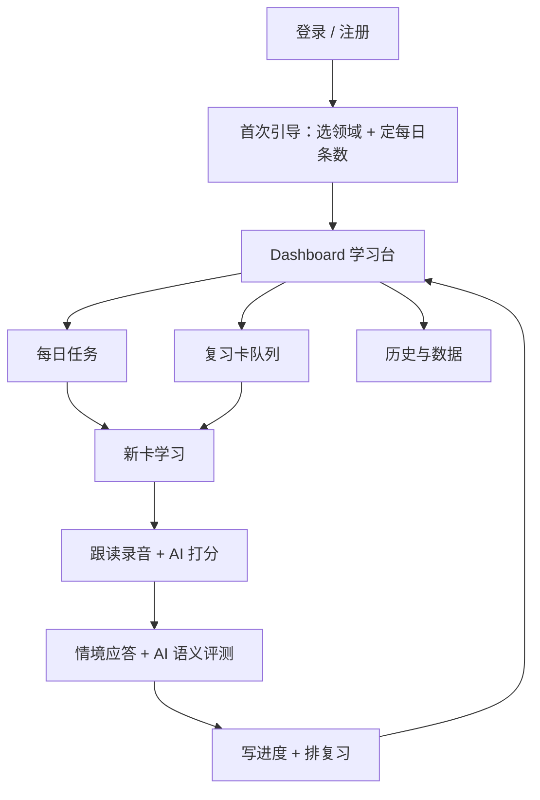
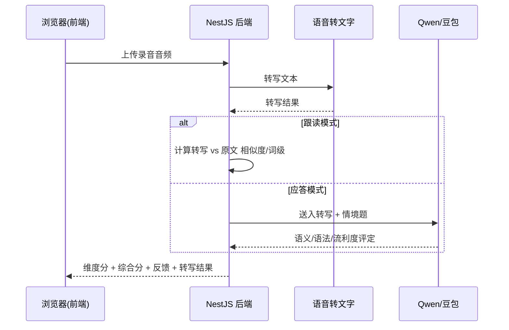
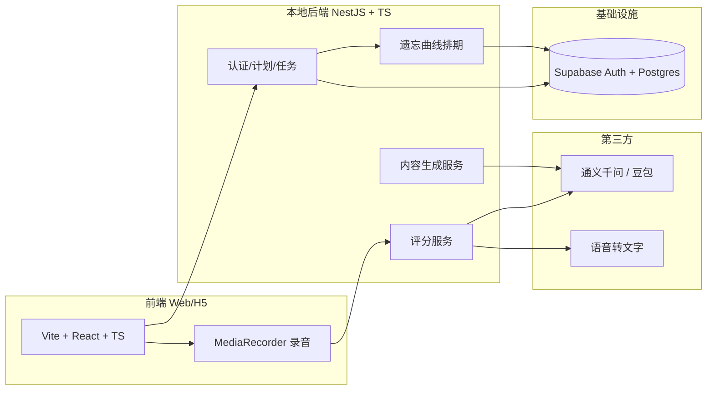

# DailySpeak · 场景化英语求职口语陪练 — 产品需求文档

| 项 | 值 |
| --- | --- |
| 版本 | **v0.2 · MVP** |
| 最后更新 | 2026-09-11 |
| 产品端 | Web 电脑端（响应式） |
| 技术栈 | 大前端 + NestJS + Supabase |
| AI | 通义千问 / 豆包 |
| 首发领域 | 计算机 / IT + 职场通用 |
| 原始版本 | [v0.1 HTML 存档](./archive/dailyspeak-prd-v0.1.html)（只读，不再修改） |

> **本文档是本项目唯一权威的需求来源。**
> 任何新增功能、口径调整、范围变更，都必须**先改本文档，再动代码**。
> 文档维护规则见 [`../README.md`](../README.md)，开发排期与待办见 [`../TODO.md`](../TODO.md)，历史决策见 [`../DECISIONS.md`](../DECISIONS.md)。

**标注约定**（沿用 v0.1）：数据若暂未实证，以 `[待确认]` 标注；产品判断以 `[产品判断]` 标注，后续可被访谈或数据修正。
**版本标注**：本文档相对 v0.1 的新增/修订内容，以 `【v0.2】` 标注。

---

## 变更记录

| 版本 | 日期 | 变更内容 | 来源 |
| --- | --- | --- | --- |
| v0.1 | — | 首次交付：11 章完整 MVP 需求 + 7 页高保真设计稿 | 原始 PRD（已存档） |
| v0.2 | 2026-09-11 | 5.1 补充字段级内联校验与密码可见性切换；5.3 补充「今日任务快照」与完成口径；**5.4 新增录音回听、ASR 转写回显与逐词对照**；6 章明确跟读分算法与转写结果的展示契约；9 章明确第三方不可用时的降级口径 | 开发过程决策 [D-002 ~ D-011](../DECISIONS.md) |

---

## 目录

| 章节 | 标题 |
| --- | --- |
| 01 | [需求背景与问题](#01-需求背景与问题) |
| 02 | [产品定位与目标](#02-产品定位与目标) |
| 03 | [用户画像与核心场景](#03-用户画像与核心场景) |
| 04 | [信息架构与页面地图](#04-信息架构与页面地图) |
| 05 | [功能需求详情（核心）](#05-功能需求详情核心) |
| 06 | [AI 语音评测设计](#06-ai-语音评测设计) |
| 07 | [数据模型](#07-数据模型) |
| 08 | [技术架构](#08-技术架构) |
| 09 | [边界与异常处理](#09-边界与异常处理) |
| 10 | [MVP 范围与排除项](#10-mvp-范围与排除项) |
| 11 | [设计图生成提示词](#11-设计图生成提示词) |

---

## 01 需求背景与问题

求职市场对英语交流能力的要求，与大多数求职者的实际口语水平之间存在明显落差。

大量岗位将「能使用英语作为工作交流语言」列为任职条件，尤其在计算机 / 互联网工程师岗位（外企、出海业务、跨团队协作）中越发普遍。英文求职沟通不只需要读懂读写，更需要当面开口——英文自我介绍、技术面试问答、日常例会与英文邮件讨论。对只通过大学英语四级、长期缺少口语练习的求职者而言，从「能看懂」到「能开口」之间存在一道几乎无法靠背单词跨越的门槛。

现有解决方案各有缺口：背单词 App 把学习引向孤立记忆，难以迁移到真实交流；系统化网课时间与金钱成本高、惰性强；面向泛英语受众的「每日一句」内容不贴合求职/行业场景，学了也用不上。核心痛点不是「不知道要学」，而是缺少一条低成本、贴合求职场景、能立刻开口并得到反馈的练习路径。

| 关键判断 | 说明 |
| --- | --- |
| CET-4 | 多数求职者英语能力的现实水平，开口交流是短板 |
| 场景化 | 把句子绑定到面试/职场/行业场景，学了能直接用 |
| 每日 2-3 次 | 碎片时间养成「开口」习惯，靠遗忘曲线对抗遗忘 |

---

## 02 产品定位与目标

本轮 MVP 的唯一目标是**验证留存**：用户是否愿意每天回来练几句。

### 一句话定位

> 「每天用真实职场场景练几句英语，跟读 + 情境应答，AI 当场打分，遗忘曲线帮你复习。」

### 核心目标（留存验证优先，暂不盈利）

- **体验完整闭环**：从登录 → 选领域 → 学一句 → 打分 → 进入复习队列，全流程可走通且不超过 5 分钟。
- **验证「每天回来」**：通过次日复习排期，制造用户回访理由；观察 7 日回访率与人均学习卡数。
- **跑通场景化内容**：以「计算机 + 职场通用」两个领域验证「所学即所用」的内容价值。

成功信号（`[产品判断]` P0、为量化埋点）：新用户当日完成首张卡的学习比例；次日起带有「复习卡」的用户的 7 日回访率（作为留存 proxy）；单用户日均完成学习卡数。

---

## 03 用户画像与核心场景

### 目标用户画像

- **求职中的应届生**：刚过四六级，投递英文岗遇阻，口语几乎零开口经验，备考期碎片时间有限。
- **初级工程师 / 职场人**：能读写技术文档，但恐惧英文面试与例会，目标明确是为跳槽/出海机会补口语。

### 核心使用场景（按优先级）

| 场景 | 触发 | 行为 | 期望结果 |
| --- | --- | --- | --- |
| 每日碎片练习 | 通勤 / 午休 / 睡前 | 打卡完成今日「新句 + 复习」 | 几分钟完成，不觉得有负担 |
| 英文自我介绍 | 准备面试 | 复习「职场通用」中的自我介绍句 | 能当面流畅说出 30-60 秒介绍 |
| 技术面试应答 | 准备计算机岗面试 | 跟读 + 情境应答技术提问 | 能用自己的话组织英文回答 |
| 口语复盘 | 学完一张卡 | 看 AI 打分与语义反馈，**回听自己的录音**、**对照识别文本**，重录 | 知道自己差在哪，针对性改进 |

> 【v0.2】「口语复盘」场景补充了两个抓手：回听自己的发音、查看 ASR 识别文本与逐词对照，见 5.4。

---

## 04 信息架构与页面地图

以「一日一任务」为主线，页面克制、功能收敛，避免 MVP 铺大。



图 1：产品核心信息流——从登录到每日学习再到复习归档

### 页面清单（MVP）

| 页面 | 定位 | 入口 |
| --- | --- | --- |
| P1 | 登录 / 注册（邮箱或手机号 + 密码） | 首屏 |
| P2 | 首次引导 Onboarding：选领域 + 每日条数 | 首次登录后 |
| P3 | 学习台 Dashboard：今日进度 + 新卡/复习入口 | 默认首页 |
| P4 | 场景卡学习页：跟读 + 应答 + 打分 | 从 P3 进入 |
| P5 | 历史与数据：日历打卡 + 学习统计 | P3 顶部入口 |

---

## 05 功能需求详情（核心）

本章为文档主体，编号与正文逻辑一一对应。MVP 为 Web 电脑端，交互节奏偏向鼠标 + 键盘。

### 5.1 账号注册与登录（P1）

路由：`/login`

```
登录 DailySpeak
用邮箱或手机号 + 密码。验证方式后期可扩展微信登录。
  邮箱 / 手机号
  密码
  [登录]
  首次使用？创建账号

创建账号
  邮箱 / 手机号
  密码
  确认密码
  [创建并下一步]
  已有账号？登录
```

#### 页面布局

居中单栏表单。顶部品牌区，中部账号表单，底部切换登录/注册。

#### 业务逻辑

用户通过邮件地址或手机号 + 密码注册/登录。后端将账号落在 Supabase Auth；首次成功登录后自动进入首次引导页（P2）。登录状态由 JWT/Session 维持，供后续所有接口鉴权。

#### 字段规则

| 字段 | 类型 | 必填 | 范围/规则 | 默认 |
| --- | --- | --- | --- | --- |
| 邮箱/手机号 | 文本 | 是 | 合法邮箱或 11 位手机号 | 无 |
| 密码 | 密码 | 是 | ≥ 8 位，大小写字母 + 数字 | 无 |
| 确认密码 | 密码 | 注册时 | 与密码一致 | 无 |

#### 边界与异常

重复邮箱给出提示；密码强度不足**内联报错**；认证服务不可用或超时时，给出重试，不静默失败。

#### 【v0.2】交互细化

- **字段级内联校验**：账号格式、密码强度、两次密码一致各自独立报错，定位到具体输入框（红框 + 下方错误文案），同时用 `aria-invalid` / `role="alert"` 保证可访问性。用户重新输入时清除该字段错误，不做「边输边红」。
- **密码可见性切换**：密码框右侧提供显示/隐藏按钮。
- **提交中防重**：提交期间按钮禁用并显示 `aria-busy`。
- **服务端错误**（重复邮箱、认证不可用等）在表单底部统一呈现，与字段错误区分。

> 决策依据：[D-002](../DECISIONS.md#d-002-登录页采用字段级内联校验)、[D-003](../DECISIONS.md#d-003-密码强度规则对齐-prd)

### 5.2 首次引导：选领域 + 定学习计划（P2）

路由：`/onboarding`

```
你想为哪个方向练英语？
  [计算机 / IT] [职场通用] [金融] [汽车制造]

每天学习几条？
  [ 3 ] 条 / 天（含复习）

[开始今日学习]
```

#### 页面布局

上为标题与领域选择区，中为每日条数设置，底部为进度条与开始按钮。

#### 业务逻辑

用户多选领域（至少 1 个）并设置每日学习条数（1-10，含复习）。确认后写入 `user_profiles`，据此筛选每日新句的内容领域与数量；进入学习台（P3）。已登录但未完成的用户再次登录时，仍停留在本页。

#### 边界与异常

领域未选时开始按钮禁用；条数越界（> 10 或 < 1）时按边界值截断并提示。

### 5.3 学习台：每日任务概览（P3）

路由：`/today`

```
今天 · 9 月 5 日            已完成 1 / 3 条        学习记录 →
────────────────────────────────────────────────
新句  项目经验这样介绍         步骤：跟读 → 应答 0/2   [开始 →]
复习  上周 · 自我介绍（第 2 次）  剩余 2 条复习到期      [开始 →]

连续 6 天 当前打卡 · 42 张 累计学习卡
本周学习日历打卡图 + 跟读平均分曲线
```

#### 页面布局

顶部为日期与今日进度；主区为今天要做的卡片，分为「新句」与「复习」两类，每张卡显示内容标题、类型与完成状态；右上为历史入口。

#### 业务逻辑

进入 P3 时，系统按 `user_profiles` 生成今日任务：新句卡数量 = 用户每日条数 − 今日到期复习卡数（不为负）；复习卡来自 `review_schedule` 中到期待复习的记录。新句按领域随机调度且去重（不重复推已学卡）。点击「开始」进入场景卡学习页（P4）。

#### 【v0.2】今日任务快照

- **当天首次进入学习台时生成并落库（`today_plan`），当天固定不变。**
  否则「完成一张复习卡 → 该卡不再到期 → 新句名额变多」会让今日条数在一天之内变化，进度出现 `1/3 → 1/4` 的跳变。
- 用户中途离开后再回来，**未完成的卡必须仍在列表里**；只做了跟读、没做应答的卡同样保留。
- **完成口径**：跟读与应答**都**完成才算一条完成（PRD 5.4「已掌握」）。只完成跟读不计入完成数。
- 已到期的复习卡不得同时出现在「新句」里（去重）。
- 卡片步骤标记只看**今天**这一轮练习的提交，复习卡不会一进页面就显示「跟读 ✓ 应答 ✓」。
- 用户修改领域或每日条数后，今日任务快照作废并重新生成。

> 决策依据：D-004、D-005

### 5.4 场景卡学习：跟读 + 情境应答（P4）

路由：`/learn/:cardId`、`/learn/:cardId/answer`、`/result/:cardId`

```
计算机  跟读
介绍你参与过的项目
  I led the refactoring of our payment module, which cut processing time by 40%.
  我主导了支付模块重构，使处理时间缩短 40%。

          ( 🎤 )

  重听原声 | 重录        完成 →
```

#### 页面布局

顶部为领域与环节标签（跟读/应答切换）；主区为一步一屏：先展示原文句与中文，录音按钮居中；第二屏展示跟读打分结果；第三屏给出面试情境题让用户即兴回答。

#### 业务逻辑 —— 跟读环节

用户点击录音按钮，浏览器采集麦克风（约 3-15 秒）。录音完成后，后端执行 06 章的「跟读评测」链路，返回维度分、综合分与逐词提示。仅当分数到达阈值或用户主动「再来一次」才推进到情境应答。

#### 业务逻辑 —— 情境应答环节

展示与当前领域/难度匹配的情境题（如技术面试提问），用户即兴作答并录音。后端执行 06 章的「应答评测」链路，返回语义正确性、语法、流利度与一句话改进建议。答完本卡后推进到 5.5 收尾。

#### 状态流转

| 当前状态 | 允许操作 | 下一状态 | 触发条件 |
| --- | --- | --- | --- |
| 待跟读 | 录音/重录 | 跟读已打分 | 录音提交并返回分 |
| 跟读已打分 | 再来一次 / 下一步 | 待应答（推进时） | 用户点下一步 |
| 待应答 | 录音/重录 | 应答已打分 → 已掌握 | 录音提交并返回分 |
| 已掌握 | 返回今日任务 | 归档 + 排复习 | 用户点完成 |

#### 【v0.2】录音回听

用户录音后必须能回听自己的发音，不能只录不听。

- 学习页（跟读）与应答页在录音结束后，录音按钮下方出现「听我的发音 / 听我的回答」按钮，可反复播放/暂停；暂停即回到起点，便于一遍遍重听。
- 结果页（跟读打分页）同样提供回听入口，方便**对照 AI 反馈复听**——这是「口语复盘」场景的核心。
- 播放自己的录音时打断浏览器 TTS（避免与「重听原声」叠音）；反之点「重听原声」时也要停掉录音回放。
- 重新录音时回收上一段音频资源。
- 音频是否持久化到服务端见 [D-017](../DECISIONS.md#d-017-音频是否落库待确认)。

> 决策依据：D-007

#### 【v0.2】ASR 转写回显与逐词对照

用户不仅要**听**到自己说了什么，还要**看**到系统听到了什么——这是判断"识别错"还是"自己读错"的唯一依据。

录音结束后，在录音区下方展示「我听到的」卡片：

- **转写全文**：服务端 ASR 返回的文本。语音识别对发音的容错很低，识别结果本身就是发音清晰度的强信号。
- **转写来源标识**：标明这段文本由哪个 ASR 供应商产生。
- **逐词对照原句**：以原句为准逐词展示，被识别错的词用红色波浪线标出，悬停显示「被听成了 XXX」；完全没识别到的词标注为漏读。
- **词级准确度**：`识别正确的词数 / 原句总词数`，以百分比呈现。

情境应答环节没有唯一原文，只回显转写文本，不做逐词对照。

转写失败时按 09 章降级策略处理（重试 → 只记完成不打分），**不允许用本地模拟文本顶替**。

> 决策依据：D-009、[D-010](../DECISIONS.md#d-010-移除全部-mock-数据按-prd-做真实实现)

### 5.5 复习机制：遗忘曲线排期

用艾宾浩斯遗忘曲线为每张学会的卡安排「下次复习时间」，制造每日回访理由。

> 图 3：遗忘曲线与建议复习点——在记忆快速衰减前安排复习。
> 原图为位图，保留在 [v0.1 存档 HTML](./archive/dailyspeak-prd-v0.1.html) 中；本 Markdown 版不含图片。

#### 排期规则

| 阶段 | 距上次复习 | 含义 |
| --- | --- | --- |
| S1 | 第 1 天 | 学完后次日快速回顾 |
| S2 | 第 2 天 | 短时强化 |
| S3 | 第 4 天 | 中期保持 |
| S4 | 第 7 天 | 周度巩固 |
| S5 | 第 15 天 | 半月强化 |
| S6 | 第 30 天 | 长期保持 |

每次复习若得高分，进入下一更长间隔阶段；得分低于阈值则回退到紧邻的上一阶段重来。到期卡计入当天「复习卡」，并受每日总条数约束。算法为纯函数、可单测，排期结果写入 `review_schedule`。

#### 【v0.2】排期推进的唯一性

一张复习卡在**一次练习会话中只允许推进一个阶段**。跟读与应答分两步提交，若两步各自触发一次排期计算，一次复习会连跳两级，遗忘曲线失真。排期统一在「整卡完成」（应答打分）时推进一次。

通过阈值取 `PASS_THRESHOLD = 85`，排期依据综合分（跟读 × 0.5 + 应答 × 0.5）。

> 决策依据：[D-006](../DECISIONS.md#d-006-复习排期一次只推进一级)

---

## 06 AI 语音评测设计

统一接入国内大模型服务商（通义千问 / 豆包，做成可替换供应商接口）。MVP 采用「ASR + 大模型语义评测」方案，发音精度通过转写一致性间接体现，后续如需音素级精修再接专业语音 SDK。

### 两层评测模型

- **语义层**（大模型擅长）：把用户的语音转成文本后交给 Qwen/豆包，判断情境应答的「内容对不对、语法、措辞、完整性」。
- **语音层**（转写一致性）：用 ASR 转写跟读内容，与原文比对（词级 WER/相似度），作为发音流利度的间接分。

### 评测链路



图 2：跟读与应答两种评测的 API 时序

### 评分维度与口径

| 环节 | 维度 | 口径 | 权重 |
| --- | --- | --- | --- |
| 跟读 | 发音流利度 | 转写相似度 / 词级错误 | 100% |
| 应答 | 内容正确性 | 大模型判定是否切题完整 | 40% |
| 应答 | 语法准确性 | 大模型判定语法错误密度 | 25% |
| 应答 | 表达流利度 | 转写相似度 + 犹豫/停顿指标 | 20% |
| 应答 | 措辞丰富度 | 大模型判定词汇/句型丰富度 | 15% |

模型服务商抽象：后端封装统一评测接口，供应商（千问/豆包）作为可替换实现；内容生成与语义评测共用同一供应商，便于对账与降本。

### 【v0.2】跟读评分算法（写实）

跟读分**完全由词级相似度决定**（对应上表 100% 权重），不再引入随机抖动或时长猜测：

1. 归一化：原文与转写各自小写化、去标点、按空白切词。
2. 对齐：用最长公共子序列（LCS）做词级对齐，得到逐词 diff。
   - 对齐上的词 → 识别正确
   - 原文有、转写没有 → 漏读或读错（若能配上相邻转写词，记为「读成了 X」）
   - 转写多出来的词 → 忽略（跟读只关心原文有没有读全）
3. `相似度 = 识别正确的词数 / 原文总词数`
4. `分数 = clamp(round(52 + 相似度 × 46), 40, 98)`
   → 100% 词准 ≈ 98 分；约 72% 词准 ≈ 85 分（通过线）；0% ≈ 52 分

**反馈必须由 diff 生成**，指出具体是哪些词出了问题，不允许输出与转写无关的模板文案。

### 【v0.2】接口返回契约

跟读评测（`POST /api/score/repeat`）除分数与反馈外，还必须返回：

| 字段 | 说明 |
| --- | --- |
| `transcript` | ASR 转写文本，用于 5.4 的「我听到的」 |
| `transcriptSource` | 产生该文本的 ASR 供应商标识 |
| `alignment` | 逐词对齐结果，供前端渲染逐词对照 |
| `similarity` | 词级相似度，供前端展示准确度 |

前端不重复实现对齐算法，只渲染服务端返回的结果。

---

## 07 数据模型

数据落在 Supabase Postgres，表结构由 Prisma ORM 管理，仅 MVP 所需的最小集合。

| 表 | 用途 | 关键字段 | 说明 |
| --- | --- | --- | --- |
| `users` | 账号 | email / phone / 密码哈希 | Supabase Auth 内置 |
| `user_profiles` | 个性化 | user_id / domains[] / daily_count | 领域多选 + 每日条数 |
| `scenario_cards` | 内容库 | domain / scene_text / scene_zh / prompt / reference_answer / difficulty / status | AI 生成 + 人工审核上线 |
| `user_progress` | 学习记录 | user_id / card_id / repeat_score / answer_score / composite / done_at | 每张卡的跟读/应答/综合分 |
| `review_schedule` | 复习排期 | user_id / card_id / stage / due_at / last_score | 遗忘曲线排期，按 due_at 拉取到期卡 |

内容双轨：`scenario_cards` 内容来自「AI 批量生成候选 + 人工抽审上线」，两者不强制绑定；首发以「计算机 + 职场通用」精编/AI 混合内容冷启动。

### 【v0.2】补充约束

| 表 | 补充字段/约束 | 原因 |
| --- | --- | --- |
| `scenario_cards` | `sentence` / `translation` / `prompt_zh` / `tag`；`status ∈ {draft, review, published}` | 支撑跟读原句、中文提示与审核状态机 |
| `user_progress` | 唯一键 `(user_id, card_id)`；`mode ∈ {new, review}` | 满足 09 章「重复提交同张卡幂等」 |
| `review_schedule` | 唯一键 `(user_id, card_id)`；索引 `(user_id, due_at)` | 按到期时间拉取，且一张卡只有一条排期 |
| `today_plan` | `user_id / date_key / tasks[]`，唯一键 `(user_id, date_key)` | 支撑 5.3 的今日任务快照 |

---

## 08 技术架构

大前端全栈，本地跑后端，Supabase 管身份与数据，AI 走国内大模型服务商。



图 4：系统架构——前端采集语音，后端编排评分，Supabase 持数据，LLM/ASR 在第三方

### 技术选型

| 层 | 选型 | 理由 |
| --- | --- | --- |
| 前端 | Vite + React + TS | H5/PC 响应式，轻量、启动快 |
| 后端 | NestJS + TS | 模块/服务分层，多子系统易维护 |
| 数据/身份 | Supabase Auth + Postgres + Prisma | 低成本认证 + 存储 + ORM 一体，后期可扩展微信/短信 |
| AI 评测 | ASR + 通义千问/豆包 | 国内访问、合规与成本友好，接口可替换 |
| 语音采集 | 浏览器 MediaRecorder / WebRTC | 前端直接采集录音，上传后端评测 |

登录设计（低成本 + 可扩展）：MVP 采用邮箱/手机号 + 密码（Supabase Auth 开箱即用，几乎零成本）；微信 OAuth、手机号短信作为后台开关，后期直接开启，无需重写认证逻辑。

### 【v0.2】工程约定

- **前端不做任何假数据**：登录态、内容库、进度、排期、评分、转写一律来自后端接口。
- **ASR 与 LLM 只在后端调用**：前端只负责采集音频并上传，不持有任何 AI 供应商密钥。
- **供应商可替换**：`AsrProvider` / `LlmProvider` 以接口注入，切换供应商不改业务逻辑。
- 供应商密钥只存在于后端环境变量，且不得进入版本库。

---

## 09 边界与异常处理

| 异常 | 处理策略 |
| --- | --- |
| AI/第三方超时或失败 | 自动重试 3 次；仍失败则降级为「仅记已完成、不产生打分」，引导用户稍后重测 |
| 录音失败 / 麦克风权限拒绝 | 提示授权并重试；提供文本输入兜底，允许不录音直接看参考答案 |
| 网络离线 | 前端缓存今日卡数据，联网后补齐提交；复习排期在服务端兜底计算 |
| 内容某领域无卡可推 | 从其他已选领域补充，保证每日条数不中断；后台提示内容告警 |
| 重复提交同张卡 | 以最近一次有效提交为准，幂等处理并更新进度 |

### 【v0.2】补充口径

- **不降级为假数据**：第三方不可用时，宁可明确告知「本次不打分」，也不允许用模拟文本或随机分数顶替（[D-010](../DECISIONS.md#d-010-移除全部-mock-数据按-prd-做真实实现)）。
- **音频上传约束**：跟读 3–15 秒、应答 30–60 秒；校验格式与大小上限，超限直接拒绝并提示。
- **降级记录**：跳过一次打分的卡片状态为「已完成、未打分」，在历史中如实展示，不伪造分数。

### 测试策略

- **单测**：遗忘曲线排期算法（边界间隔、分数回退）、词级对齐与相似度、评分映射、provider 的错误/超时/降级分支。
- **端到端**：登录 → 选领域 → 学一张卡 → 打分 → 入复习队列，主链路用 Playwright（Web 端）。

---

## 10 MVP 范围与排除项

### 本期包含

- 邮箱/手机号 + 密码登录（Supabase Auth）
- 首次引导：领域多选（首发计算机 + 职场通用）+ 每日条数
- 场景卡学习：跟读 + 情境应答 + AI 打分与反馈
- **录音回听与 ASR 转写回显**（含逐词对照）
- 遗忘曲线自动复习与每日复习队列
- 基础历史/打卡与学习统计
- 内容生成管道：AI 生成候选 + 人工抽审上线

### 本期明确不做（YAGNI，二期考虑）

- 盈利 / 订阅 / 付费墙（先验留存）
- 排行榜 / 社交 / 打卡 PK / 组队监督
- 视频课程 / 精品长课
- 音素级精修发音评测（后续接专业 SDK）
- 复杂多设备实时同步、离线完整包
- 推送通知（先以站内任务 + 复习为回访钩子）

范围原则：MVP 的一切取舍以「验证用户愿不愿意每天回来学几句」为前提，其余功能一律后置。

---

## 11 设计图生成提示词

用于在 Trae Design 模式或 Google Stitch 等工具生成产品高保真设计图。封装为一段可直接复制、面向电脑端（Web / H5）且与本文档功能模块一一对应的提示词。

复制以下提示词（英文为主，便于多工具识别，可整体替换或追加中文说明）：

> Design the web (desktop, responsive) UI for "DailySpeak", a daily English speaking practice product that helps job seekers with CET-4 level English improve conversational skills for interviews and workplace communication. Modern, fresh, friendly learning aesthetic. Use a clean white/light background with a fresh blue-to-teal gradient accent (#3b82f6 → #10b981). Rounded cards, generous whitespace, mobile-first responsive layout, subtle shadows, sans-serif typography with clear hierarchy. No garbled text; keep any on-screen English correct and minimal.
>
> Produce high-fidelity designs for these PC screens, one by one:
> 1. LOGIN: centered card, email/phone + password fields, primary gradient "登录" button and a "创建账号" secondary link.
> 2. ONBOARDING: multi-select domain chips (计算机/IT, 职场通用, 金融, 汽车制造 — show the first two selected), a "每天学习几条" number input (default 3), and a progress bar + "开始今日学习" button.
> 3. DASHBOARD: today's date + completion progress (light 1/3 done), list of cards split into "新句" new-phrase cards and "复习" review cards, each showing title, step progress (跟读→应答), and a start affordance; top-right link to learning history.
> 4. LEARNING (repeat): a "计算机" domain tag + "跟读" step tag, the target English sentence shown large with its Chinese translation below, a large circular record/mic button centered, and bottom controls for replay/retake and a "完成" button.
> 5. RESULT: two large circular score rings — repeat pronunciation score (e.g. 92) and a pending answer ring — plus a pronunciation feedback card and a "进入情境应答 →" primary button.
> 6. ANSWER: an interviewer question card (English + Chinese), the record mic button, and a hint to answer in own words for 30–60 seconds.
> 7. HISTORY: monthly stats (streak count, total cards learned) as stat cards, plus a weekly chart placeholder.
>
> For each screen use consistent visual language: light background, gradient primary actions, rounded cards, clear spacing. Output as clean, presentation-ready UI mockups.

### 使用说明

- **Trae Design 模式**：直接粘贴上述提示词，工具会按列表逐屏生成界面设计。
- **Google Stitch / 其他生成工具**：可整体粘贴，或将「Produce high-fidelity designs for these PC screens」改为一次生成单屏的句式，逐屏生成便于迭代。
- **微调指引**：想换风格（如更科技感、更卡通风），替换第 1 段的视觉描述即可；想只生成某一屏，只复制该屏标题那一行。
- **与开发对应**：每屏编号与本文档 5.x 功能模块一一对应，便于设计还原时对齐需求。
- 【v0.2】新增画面的设计还原见 `design/pages/`（7 页 HTML），实现见 `src/pages/`。

---

*DailySpeak · MVP 产品需求文档 — 为开发与设计还原提供一站式依据*
